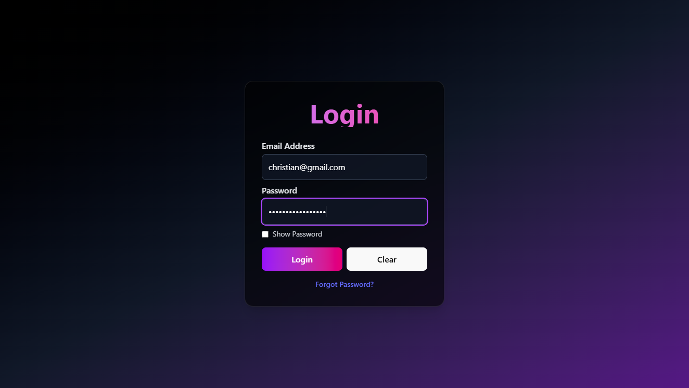

name: React Login Form
description: >
  A modern and responsive Login UI Form built with React (Vite) 
  and styled using TailwindCSS. This project demonstrates how to 
  create a clean authentication interface with validation and 
  mobile-friendly design.  

repository: https://github.com/xtianmay/LoginForm.git

screenshot:
  |  |  
  alt: "React Login Form UI"
  description: >
    A preview of the login form showcasing a clean and minimal 
    design with responsive styling using TailwindCSS.

features:
  - Responsive login form UI
  - Built with React + Vite for fast development
  - Styled using TailwindCSS utility classes
  - Includes username and password input fields
  - Basic client-side form validation
  - Lightweight and customizable structure

installation:
  steps:
    - step: Clone the repository
      command: git clone https://github.com/xtianmay/LoginForm.git
    - step: Navigate into the project folder
      command: cd LoginForm
    - step: Install dependencies
      command: npm install
    - step: Start the development server
      command: npm run dev
  note: The app will be available at http://localhost:5173 by default (Vite).

deployment:
  options:
    - GitHub Pages
    - Netlify
    - Vercel
  instructions: >
    Run `npm run build` to generate a production-ready build.
    Deploy the contents of the `dist/` folder to your preferred
    hosting service.

contributing:
  guidelines: >
    Contributions are welcome! If you'd like to improve the UI,
    add features, or fix bugs, feel free to fork this repository,
    create a new branch, and submit a pull request.

license:
  type: Apache 2.0
  file: ./LICENSE
